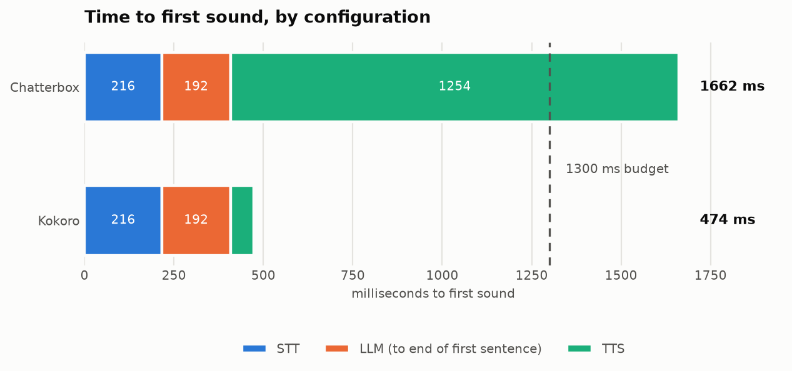

<div align="center">

# Naka

**A voice assistant that lives on your graphics card.**

Hold a key, speak, and hear her answer in under a second.<br>
Speech recognition, the language model and the voice all run on your own PC.

[](#requirements)
[](#requirements)
[](#privacy)
[](pyproject.toml)
[](LICENSE)

[Features](#features) · [Requirements](#requirements) · [Install](#install) · [Using Naka](#using-naka) · [Privacy](#privacy) · [Architecture](ARCHITECTURE.md)

</div>

## Why Naka

Most voice assistants send your voice to a server, wait for an answer, and speak it back with a voice you cannot change. Naka does all three steps on your machine. She is quick because nothing crosses the internet. She keeps working when the connection drops, and what you say to her stays on your disk.

She is also meant to be someone rather than something: a persona you can edit, a voice with its own character, and a memory of what matters to you.

## Features

- **Push to talk from anywhere.** Hold right Ctrl (or any key you choose) in a game, an editor or on the desktop. The key is global.
- **Fast replies.** She starts speaking as soon as the first sentence is ready, typically 0.5 to 0.8 seconds after you stop talking.
- **A voice of her own.** Kokoro speech with a tunable effects chain (pitch, formants, chorus, compression) that gives her a consistent, slightly synthetic character.
- **Memory.** She keeps a short list of facts about you and a rolling summary of the conversation. You can read and edit both in the panel.
- **Tools.** Timers that ring, notes in a plain folder on your disk, the clock, GPU status.
- **Optional web access.** Search the web and read pages when she needs something recent. Off until you turn it on.
- **Optional PowerShell.** She can look around your PC and act on it. Anything that changes something waits for you to say yes out loud.
- **Plays well with games.** The models leave the GPU after a minute of silence and come back when you press the talk key.
- **A tray app, not a service.** One icon in the notification area and a control panel in its own window. Quit means quit, and nothing is left holding your GPU.

## Requirements

| | Minimum | Recommended |
|:-|:-|:-|
| OS | Windows 10 or 11, 64 bit | Windows 11 |
| GPU | NVIDIA with about 10 GB of memory | 16 GB, so a game fits alongside |
| Driver | NVIDIA 570 or newer | Latest Game Ready or Studio driver |
| Disk | About 20 GB free | SSD |
| Microphone | Any | A headset, so she does not hear herself |

Naka currently listens and speaks in English.

## Install

1. Run `Naka-setup-0.1.0.exe`. It installs per user, with no administrator prompt.
2. Setup opens in its own window. It checks your graphics card, then downloads Python, the runtime, llama.cpp and the models. Every download is pinned by version and checked against a SHA-256 hash.
3. Pick a language model. Gemma 4 12B is recommended. Qwen3 14B is offered on cards with room for it.
4. When setup says Naka is ready, hold the talk key and say hello.

If setup stops (a lost connection, a full disk), run Naka again and it picks up from the step that failed.

> [!NOTE]
> Installers are not published on the Releases page yet. To build one yourself, see [Building from source](#building-from-source).

## Using Naka

**Talking.** Hold the talk key, speak, let go. She answers out loud, sentence by sentence as the reply is written.

**The panel.** Choose *Open Naka* in the tray menu. From there you can:

- read and edit what she remembers about you,
- browse and edit your notes and timers,
- see which tools she has, and switch web and PowerShell on or off,
- change her name, voice, model and push to talk key in Settings.

**Freeing the GPU.** Before a game, choose *Release the GPU* in the tray menu, or just let her idle for a minute. The next time you press the talk key she reloads, which takes a few seconds.

**Giving her more reach.** Web and PowerShell are both off by default. Turn them on in the Tools drawer or under Settings, Powers.

| Power | What she can do | What protects you |
|:-|:-|:-|
| Web | Search, then read the pages she finds | Pages on your PC or local network are refused. Page content is treated as untrusted. |
| PowerShell | Run commands as you, starting in `Documents\Naka Workspace` | Only commands that just look run on their own. Everything else is read out and waits for your yes. After she reads a web page, every command waits. Each command has a time and memory limit, and a stop request ends it along with everything it started. |

Every tool call, whether it ran, was refused or was declined, is written to an audit log.

## Privacy

- **The models never leave your PC.** Speech recognition (Whisper), the language model (llama.cpp) and speech synthesis (Kokoro) all run locally.
- **Nothing goes out by default.** The only network traffic is setup downloading its files. At runtime the models are opened in offline mode.
- **The web is opt in.** With web access on, her searches and the pages she reads go out. Your voice and your conversation do not.
- **Your data is plain files** in `%LOCALAPPDATA%\Naka`: settings, facts, logs. Notes go to `Documents\Naka Notes`. Uninstalling asks before it removes the data folder, and never touches your notes.

## Make her yours

Everything that defines her lives in `%LOCALAPPDATA%\Naka\config`:

| File | What it controls |
|:-|:-|
| `persona.md` | Who she is and how she talks |
| `voice.toml` | Her voice and the effects on it |
| `settings.toml` | Names, keys, model, powers, resource limits |
| `tools.yaml` | Which tools exist and which ones ask first |
| `facts.json` | What she remembers about you |

Most of this can also be changed from the panel. Changes apply on the next reply, except the model and speech settings, which apply the next time the models load.

## Performance

Measured on an RTX 5070 Ti with Gemma 4 12B and Kokoro, from the end of speech to the first sound:

<picture>
  <source media="(prefers-color-scheme: dark)" srcset="eval/charts/e2e-latency-dark.png">
  
</picture>

About 0.5 seconds on the server, and 0.5 to 0.8 seconds heard from the tray app. Full benchmarks are in [eval/RESULTS.md](eval/RESULTS.md).

## Building from source

You need [uv](https://docs.astral.sh/uv/), Node (the version in `ui/.nvmrc`) and, for the installer, [Inno Setup 7](https://jrsoftware.org/isinfo.php).

```powershell
git clone https://github.com/ErwanHeschung/NakaV2.git
cd NakaV2
uv run python packaging\build.py
```

This builds the panel, freezes `Naka.exe` into `build\dist\Naka` and packs the installer into `build\`. To run from a checkout during development, see [scripts/README.md](scripts/README.md).

The guardrails around tools have their own test suite, which drives the agent loop with scripted model replies:

```powershell
uv run python eval\test_guardrails.py
```

How the pieces fit together is described in [ARCHITECTURE.md](ARCHITECTURE.md).

## Acknowledgements

Naka is built on [llama.cpp](https://github.com/ggml-org/llama.cpp), [faster-whisper](https://github.com/SYSTRAN/faster-whisper), [Kokoro](https://github.com/hexgrad/kokoro), [FastAPI](https://fastapi.tiangolo.com/), [pywebview](https://pywebview.flowrl.com/) and [Lucide](https://lucide.dev/) icons, among others. The full list, with licences, is in [THIRD-PARTY-NOTICES.md](THIRD-PARTY-NOTICES.md).

## License

Naka's code is released under the [MIT License](LICENSE). The models it downloads come with their own terms, notably the [Gemma Terms of Use](https://ai.google.dev/gemma/terms), which you accept when setup downloads them.
