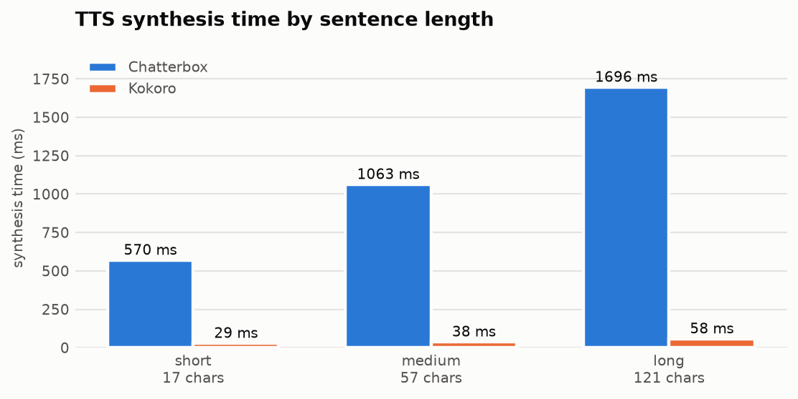
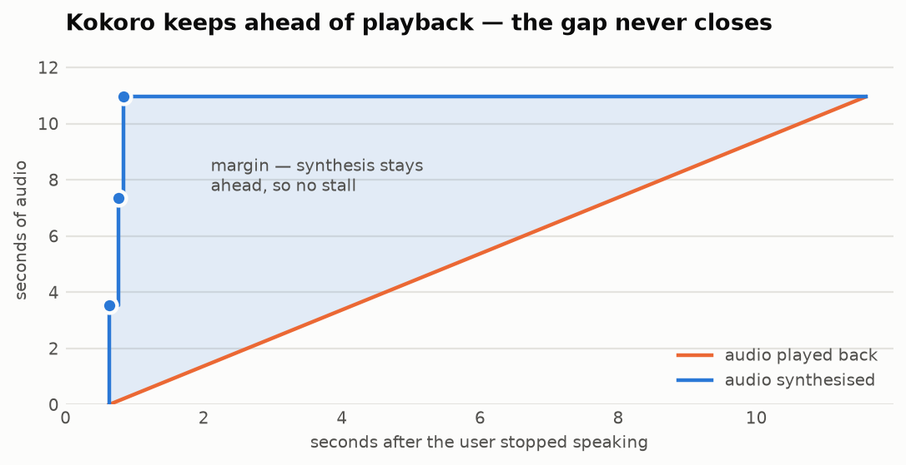
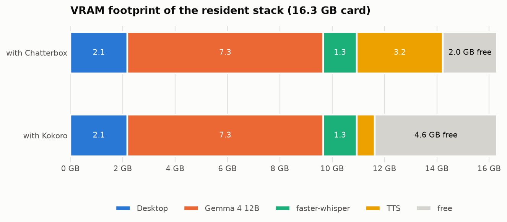

# Phase 0 benchmark results

De-risking run for Naka's pipeline: does a locally-hosted STT → LLM → TTS chain
meet the latency and VRAM budgets on this machine, and is a Q4-quantised
~12B model reliable enough at tool calling to build agentic features on?

**Date:** 2026-09-19 · **Verdict:** all gates pass. Gemma 4 12B and Kokoro selected.

---

## Bench configuration

Everything below was measured on one machine, with all components resident
simultaneously unless stated otherwise.

### Hardware & host

| | |
|---|---|
| GPU | NVIDIA GeForce RTX 5070 Ti, 16303 MiB (Blackwell, `sm_120`, compute capability 12.0) |
| Driver | 616.92 (installed on Windows; WSL uses CUDA passthrough) |
| CPU | AMD Ryzen 7 9800X3D, 8 cores |
| OS | Ubuntu 26.04 LTS under WSL2, kernel `6.18.33.2-microsoft-standard-WSL2` |
| Python | 3.12.14 (uv-managed) · torch `2.11.0+cu128` |
| Docker | 29.1.3 |

A desktop session holds ~2.1 GB of VRAM throughout; that baseline is included
in every VRAM figure below rather than subtracted out.

### Language model

| | |
|---|---|
| Model | `google/gemma-4-12B-it-qat-q4_0-gguf` → `gemma-4-12b-it-qat-q4_0.gguf` (quantisation-aware trained Q4_0) |
| Runtime | `ghcr.io/ggml-org/llama.cpp`, pinned by digest `sha256:131a7be5…925b85` |
| Build | llama.cpp `0.4.1-dev` (build 11046, commit `60081bb2b`) |
| Flags | `--n-gpu-layers 999 --parallel 1 --ctx-size 8192 --jinja` |
| Sampling | `temperature 0`, `chat_template_kwargs: {"enable_thinking": false}` |

`enable_thinking: false` is **not optional** — see [Reasoning mode](#reasoning-mode-must-be-disabled).

Also benchmarked for comparison: `Qwen/Qwen3-14B-GGUF` → `Qwen3-14B-Q4_K_M.gguf`.

### Speech to text

| | |
|---|---|
| Model | faster-whisper `large-v3-turbo` (faster-whisper 1.2.1, CTranslate2 4.8.2) |
| Compute type | `int8_float16` |
| Decoding | `beam_size=5`, `language="en"` (forced, per spec) |

### Text to speech

| | |
|---|---|
| Selected | Kokoro 0.9.4, voice `af_heart`, `lang_code="a"`, 24 kHz, fp32 |
| Compared against | Chatterbox 0.1.7, default conditionals, fp32, 24 kHz |

### Methodology

- Every component is **warmed up** before timing; the first inference compiles
  kernels and would otherwise report boot cost rather than steady-state latency.
  Cold vs warm is a real gap: Chatterbox's first call was 1238 ms against a
  ~150 ms warm figure.
- Component benchmarks report the **best of 3 runs**; end-to-end figures are
  **medians of 5**, after a full warm-up pass on the real payload.
  Single samples are not trustworthy here — an early version of `e2e_bench.py`
  took one, and the spread was wide enough to make the LLM stage look
  engine-dependent when it is the same container in every configuration.
- VRAM is read from `nvidia-smi` with the whole stack loaded. `torch.cuda.mem_get_info()`
  is unreliable here — under WSL2 it does not account for another process's
  allocation, reporting 1.2 GB while `nvidia-smi` showed 9.6 GB.
- End-to-end runs use a synthesised 3-second utterance,
  *"What's the weather like in Paris today?"*, so the pipeline runs on real audio.

Reproduce with:

```bash
./setup.sh && docker compose up -d llm
uv run python eval/check_gpu.py        # sm_120 gate
uv run python eval/stt_bench.py        # faster-whisper
uv run python eval/kokoro_bench.py     # TTS
uv run python eval/toolcall_bench.py --no-think   # tool-calling gate
uv run python eval/e2e_bench.py        # time to first sound
uv run python eval/stream_bench.py     # streaming / underruns
```

---

## Headline: time to first sound

The budget is **1300 ms** from end of user speech to first audible output.

<picture>
  <source media="(prefers-color-scheme: dark)" srcset="charts/e2e-latency-dark.png">
  
</picture>

Both rows use the same prompt and produce the same first sentence
(*"It is currently cloudy with a high of twenty degrees Celsius in Paris."*),
so STT and the LLM are the **same measured stages** — only the TTS engine differs.

| Stage | Chatterbox | Kokoro |
|---|---|---|
| STT | 216 ms | 216 ms |
| LLM (to end of first sentence) | 192 ms | 192 ms |
| TTS | 1254 ms | **66 ms** |
| **Total** | **1662 ms** — over budget | **474 ms** — passes with ~830 ms spare |

Stage spread over 5 runs: STT 202–223 ms, LLM 190–221 ms, Kokoro TTS 63–67 ms.
The Chatterbox TTS figure is a single sample taken before the package was
removed; the engine's repeated component measurements are in the next section.

The headroom matters more than the pass mark: the figures above cover only
STT → LLM → TTS. VAD end-of-speech detection, transport to the Windows client,
Opus encoding and the Phase 2 DSP chain all still have to fit inside the same
budget.

Chatterbox could be dragged under the line by forcing a short first sentence —
constraining the opener to *"It is currently cloudy."* cut its synthesis from
1254 ms to 753 ms — but that is a prompt workaround for a slow engine, and it
left only tens of milliseconds of slack. Kokoro needs no such trick, though
keeping replies short is still worth doing in `persona.md` for its own sake.

---

## TTS is the whole story

In a three-sentence reply the LLM emitted **everything within 1.17 s** while
Chatterbox needed **4.69 s** to voice it. The language model was never the
constraint; a faster LLM would have bought nothing.

<picture>
  <source media="(prefers-color-scheme: dark)" srcset="charts/tts-latency-dark.png">
  
</picture>

| Sentence | Chatterbox | Kokoro | Speed-up |
|---|---|---|---|
| short (17 chars) | 570 ms | **29 ms** | 20× |
| medium (57 chars) | 1063 ms | **38 ms** | 28× |
| long (121 chars) | 1696 ms | **58 ms** | 29× |
| Real-time factor | 2.2–3.1× | **58–112×** | |
| VRAM | ~3.3 GB | **684 MB** | |

**Decision: Kokoro.** The cost is losing Chatterbox's zero-shot voice cloning
from a reference sample, which the spec's Phase 2 assumed. Kokoro offers fixed,
blendable voices instead. This is acceptable because the spec's own position is
that the non-human character comes mostly from the DSP chain rather than the TTS
model — so Phase 2 becomes "pick and blend a voice, then shape it with DSP".

---

## Sentence streaming holds

Chatterbox has no streaming API and neither does Kokoro — `generate()` returns a
whole waveform. Splitting LLM output on `.!?` and synthesising sentence by
sentence is therefore mandatory, not an optimisation.

The risk in that design is an **underrun**: playback catching up to synthesis
and stalling mid-reply, which sounds worse than a slow start. It does not happen.

<picture>
  <source media="(prefers-color-scheme: dark)" srcset="charts/streaming-margin-dark.png">
  
</picture>

| # | LLM sentence ready | TTS done | Audio produced | Audio needed by then | Margin |
|---|---|---|---|---|---|
| 1 | 0.43 s | 0.63 s | 3.52 s | 0.00 s | +3.52 s |
| 2 | 0.59 s | 0.77 s | 7.35 s | 0.14 s | +7.21 s |
| 3 | 0.78 s | 0.84 s | 10.95 s | 0.21 s | +10.74 s |

Underruns: **0**. The entire 10.95-second reply is synthesised 0.84 s after the
user stops speaking. Chatterbox also reached 0 underruns, but only after a
2.05 s start.

One caveat worth keeping: **streaming does not improve time to first sound.**
That path — STT, then the first sentence, then synthesising it — is inherently
sequential. Streaming buys everything *after* sentence one.

GPU contention between the llama.cpp container and in-process TTS proved
negligible, so the spec's global-GPU-lock concern is softer than expected.

---

## VRAM budget

<picture>
  <source media="(prefers-color-scheme: dark)" srcset="charts/vram-dark.png">
  
</picture>

| Component | VRAM |
|---|---|
| Desktop session | 2175 MiB |
| Gemma 4 12B Q4_0 (container, 8192 ctx) | 7479 MiB |
| faster-whisper `large-v3-turbo` `int8_float16` | 1289 MiB |
| Kokoro | 684 MiB |
| **Free** | **4676 MiB** |

Measured stable across repeated long utterances. With Chatterbox the same stack
left only 2072 MiB free.

> **Measurement trap:** Chatterbox measured *in isolation* reports ~7.1 GB, not
> 3.3 GB. PyTorch's caching allocator expands opportunistically when memory is
> free, so a component benchmarked alone overstates its real footprint. Always
> measure with the full stack resident.

---

## Tool-calling go/no-go

The spec's key risk: models in this class are often fluent in conversation but
unreliable at multi-step tool calling, and discovering that in Phase 4 — with
the product built around it — is the expensive path.

20 prompts against 4 fictional tools (`get_weather`, `set_timer`, `search_notes`,
`send_message`), scoring four failure modes separately.

| | Qwen3 14B Q4_K_M | Gemma 4 12B QAT Q4_0 |
|---|---|---|
| Passed | **20 / 20** | **20 / 20** |
| Malformed / schema-violating calls | 0 | 0 |
| Wrong tool selected | 0 | 0 |
| Bad arguments | 0 | 0 |
| False-positive calls (no tool needed) | 0 | 0 |

Both models are comfortably good enough; **agentic features are green-lit.**

The prompt set deliberately includes four conversational prompts that must *not*
trigger a tool, and three underspecified prompts missing a required argument.
Both models asked for clarification rather than inventing a value — the scoring
was corrected mid-run to stop counting that correct behaviour as a failure.

### Model comparison

| | Qwen3 14B Q4_K_M | Gemma 4 12B QAT Q4_0 |
|---|---|---|
| Time to first token (warm) | **47 ms** | 144 ms |
| Throughput | 70 tok/s | **82 tok/s** |
| VRAM | ~9.9 GB | **~7.5 GB** |

**Gemma 4 12B selected.** Its ~2 GB VRAM advantage matters because STT and TTS
share the card; Qwen's better TTFT is irrelevant when both sit far inside the
300 ms sub-budget. Qwen3 remains in `.models/` and can be swapped in with
`MODEL=Qwen3-14B-Q4_K_M.gguf docker compose up -d llm`.

---

## Reasoning mode must be disabled

Both Gemma 4 and Qwen3 emit `reasoning_content` by default. With a 256-token cap
**neither produced a single user-facing token** — the entire budget went to
reasoning the user would never hear.

| Qwen3 14B | Time to first token | Reasoning tokens | Visible tokens |
|---|---|---|---|
| Default | 142 ms | 254 | **0** |
| `enable_thinking: false` | 69 ms | 0 | 256 |

Reasoning tokens are pure added latency in a voice pipeline. This belongs in
`server/llm.py` from the start, not as a later optimisation.

It also makes naive TTFT measurement misleading: the "first token" in the default
configuration is one that never reaches the speakers. `eval/llm_bench.py`
separates the two counts for this reason.

---

## Environment gotchas

Recorded because each cost real time and none is obvious:

- **Blackwell needs `cu128` wheels.** `cu121`/`cu124` install cleanly and report
  `cuda.is_available() == True`, then fail at the first real op with
  *no kernel image is available for execution on the device*.
  `eval/check_gpu.py` forces an actual matmul rather than trusting the flag.
- **`chatterbox-tts` hard-pins `torch==2.6.0`**, which ships no `sm_120` kernels.
  Held off with `[tool.uv] override-dependencies` in `pyproject.toml`; that block
  stays even though Chatterbox has been dropped, because ML packages routinely
  pin exact torch versions.
- **Chatterbox is fp32 and not dtype-generic.** `.half()` fails with dtype
  mismatches deep in the stack. `torch.autocast` works and is marginally faster
  but does **not** reduce VRAM.
- **`import torch` must precede `faster_whisper`.** CTranslate2 `dlopen`s
  `libcublas.so.12` and does not bundle it; it resolves only because importing
  torch has already loaded the CUDA libraries into the process. Import the other
  way round and it fails with *Library libcublas.so.12 is not found or cannot be
  loaded*, despite the library being installed. This applies to `server/stt.py`.
- **Never install an NVIDIA driver inside WSL** — CUDA passthrough uses the
  Windows driver.
- **`usermod -aG docker` needs a full `wsl --shutdown`**, not just a new
  terminal; WSL keeps the login session alive across those.

---

## What this does not answer

- No VAD, audio transport, Opus encoding or DSP is measured — those costs are
  still unaccounted for and come out of the remaining ~830 ms.
- Latency was measured with a single synthesised utterance, not across varied
  speakers, accents, or background noise.
- Transcription accuracy was not scored; only latency was.
- Voice quality is unassessed — it is subjective and belongs to Phase 2. Samples
  for listening are in `eval/audio/samples/`.
